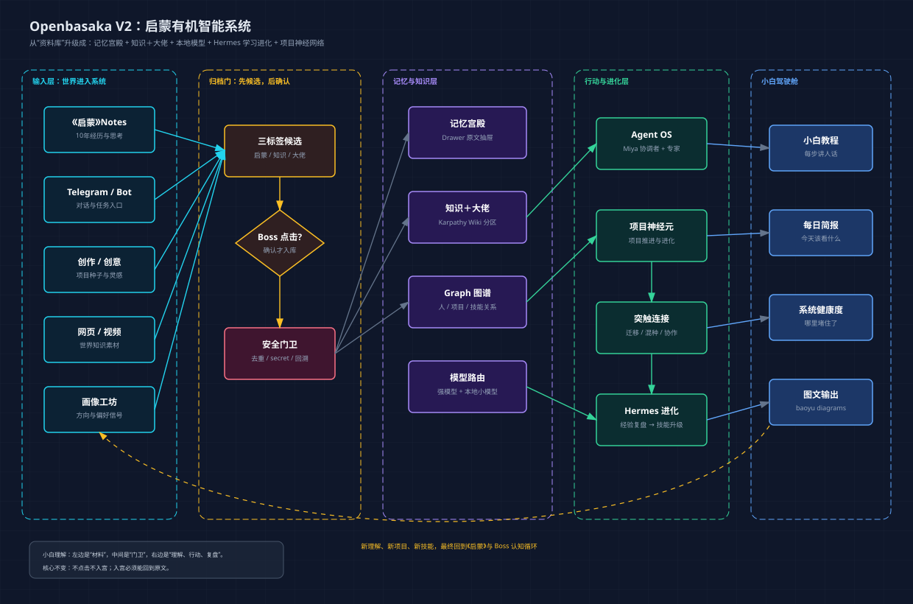
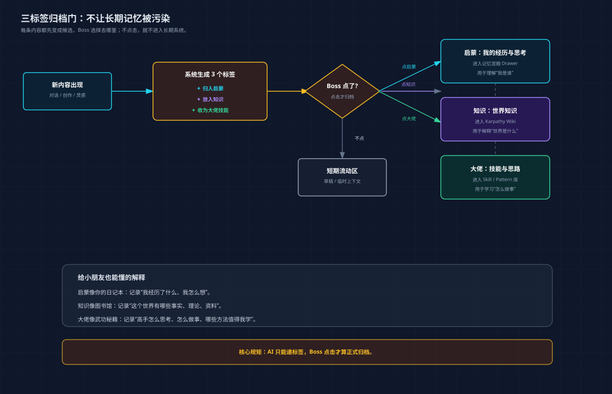
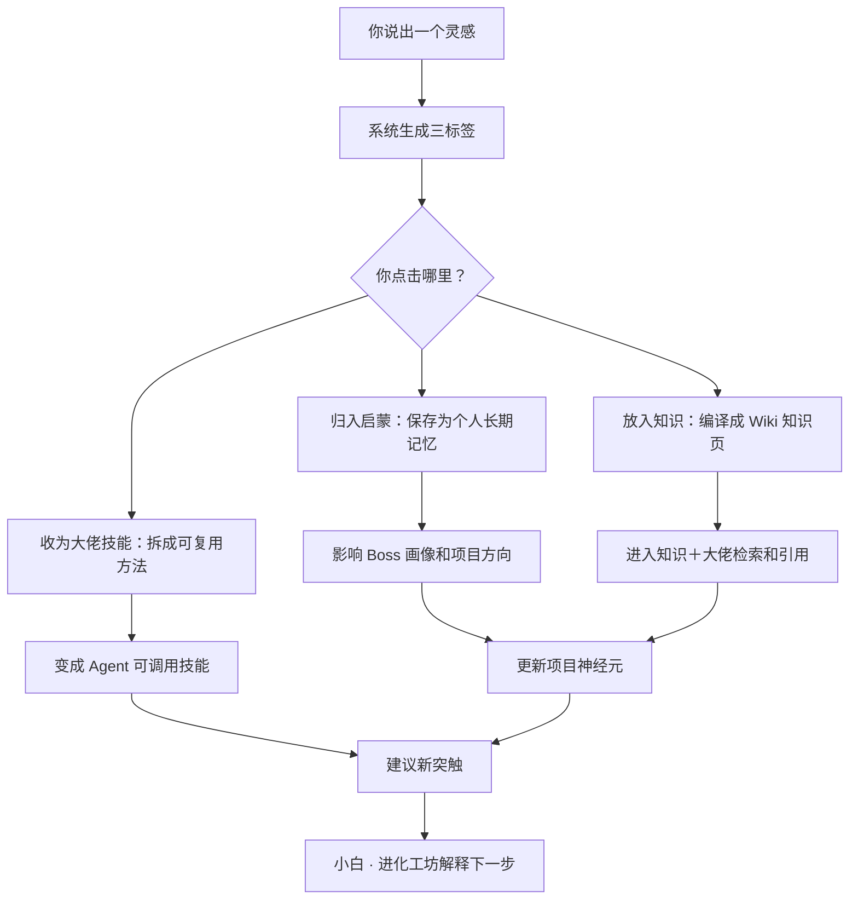

# Openbasaka V2 最终计划：知识＋大佬、本地模型、Hermes 进化

> 这份是“超级小白也能慢慢看懂”的计划。它不会假装技术不存在，但会把技术翻译成人话。

## 0. 这次升级解决什么

在上一版计划里，我们已经确定了三架齿轮：

1. **《启蒙》**：你过去 10 年的经历、思考、心愿、项目构想。
2. **画像工坊**：你探索世界的方向盘。
3. **创意项目 / Agent 行动**：你真正和世界发生作用的方式。

这次新增三件关键事：

1. 原来的“知识库”改名为 **知识＋大佬**，并分成：
   - 我的启蒙：我过去的笔记、经历与思考。
   - 大佬技能与思路：高手的方法、工作流、范式、招式。
   - 世界知识：论文、网页、视频、事实、趋势、外部资料。
2. 所有内容旁边不再只有“归入启蒙”一个标签，而是有 **三个可点击标签**：
   - 归入启蒙
   - 放入知识
   - 收为大佬技能
3. Openbasaka 需要模型路由：
   - 大事、难事、深度理解用强模型。
   - 分类、标签、去重、标题、格式化、小白解释等小任务用本地模型，例如 `gemma-4-E4B-it`。

## 1. baoyu-diagram 图：系统总图

下面这张图是用 `baoyu-diagram` 的规则生成的。



小白理解：

- 左边是世界进入系统：你的笔记、Telegram、创意、网页、画像测试。
- 中间是门卫：AI 先给标签，你点击后才正式保存。
- 右边是系统真正变聪明：Wiki、Graph、Agent、神经元、突触、Hermes 进化。
- 最右边是你能看懂的驾驶舱：小白教程、每日简报、健康度、图文输出。

## 2. 新名字：知识＋大佬

原来的“知识库”这个名字太普通，也容易让人误会成“资料堆”。新的名字叫：

> **知识＋大佬**

它的含义是：

- **知识**：这个世界有什么事实、理论、资料、趋势。
- **大佬**：高手们是怎么思考、怎么做事、怎么形成方法的。
- **加号**：不是分开收藏，而是要让世界知识和大佬方法一起反哺你。

### 2.1 三个分区

| 分区 | 小白解释 | 放什么 | 核心问题 |
|---|---|---|---|
| 我的启蒙 | 你的精神日记本 | 过去笔记、经历、思考、愿望、项目种子 | 我是谁？我为什么这样探索世界？ |
| 大佬技能与思路 | 高手武功秘籍 | Karpathy、Hermes、baoyu、Graphify、MemPalace 等方法 | 高手怎么做？我能学哪一招？ |
| 世界知识 | 图书馆 | 论文、网页、视频、新闻、资料、事实 | 世界发生了什么？这些知识说明什么？ |

注意：**我的启蒙**虽然显示在“知识＋大佬”里，但它的底层仍然必须遵守记忆宫殿规则：原文进 Drawer，分类进 wing / hall / room / facet。

### 2.2 为什么不是继续叫知识库

“知识库”听起来像仓库。

但你要的不是仓库，而是：

- 能回忆你是谁。
- 能学习高手怎么做事。
- 能理解世界发生了什么。
- 能把这些东西转成项目、判断、行动。

所以它应该叫 **知识＋大佬**。

## 3. 三标签归档门

这是本次最重要的小功能，看起来小，其实决定整个系统能不能长期变聪明。



### 3.1 三个标签是什么

每当你产生一段内容，比如：

- 一段对话
- 一个创意
- 一次项目推演
- 一条 Telegram 消息
- 一篇网页摘要
- 一个大佬方法
- 一个小白诊断结果

系统不应该偷偷保存，而应该在内容旁边生成三个自然标签：

```text
✦ 归入启蒙
✦ 放入知识
✦ 收为大佬技能
```

你点击哪个，它就走哪条路。

### 3.2 三个标签分别代表什么

#### 标签一：归入启蒙

适合：

- 和你自己经历有关。
- 和你的愿望、困惑、心境有关。
- 和你的长期项目种子有关。
- 能帮助系统更理解你。

例子：

```text
“我一直觉得真正的个人智能系统应该陪我探索世界，而不是只回答问题。”
```

这应该归入启蒙，因为它说明了你的长期愿景。

#### 标签二：放入知识

适合：

- 外部事实。
- 世界知识。
- 论文、网页、新闻、视频。
- 某个技术、产品、概念的客观资料。

例子：

```text
Gemma 4 E4B-it 是一个适合边缘设备和本地任务的 instruct 模型。
```

这应该放入知识，因为它是外部世界知识。

#### 标签三：收为大佬技能

适合：

- 高手的工作流。
- 可以反复使用的方法。
- 一套判断框架。
- 一种提示词结构。
- 一个 Agent 协作模式。
- 一个“下次也能照着做”的招式。

例子：

```text
Graphify 的做法：先用 AST 提取代码结构，再用 LLM 提取语义关系，最后生成可查询图谱。
```

这应该收为大佬技能，因为它不是单纯知识，而是一套可模仿的方法。

## 4. Karpathy Wiki 规则继续保留

虽然名字改成 **知识＋大佬**，但底层知识编译规则不能乱。

继续采用 Karpathy LLM Wiki 思路：

```text
Raw 原始来源
  -> Drawer / Source 原文保存
  -> Wiki Page 结构化页面
  -> index / log / hot / schema
  -> query with citations
  -> 好答案回写成新页面
```

### 4.1 三个分区如何使用 Karpathy 规则

| 分区 | Raw 保存 | Wiki 页面 | Citation 来源 | 特别要求 |
|---|---|---|---|---|
| 我的启蒙 | 必须逐字保存 | 可以整理成主题页 | 必须点回原始笔记 | 不能用摘要替代原文 |
| 大佬技能与思路 | 保存原文/链接/截图说明 | 拆成方法卡、步骤卡、适用场景 | 必须标明来自哪个大佬/项目 | 要能转成 Agent skill 或项目突触 |
| 世界知识 | 保存网页/论文/视频 transcript | 编译成知识页 | 必须有外部来源 | 要区分事实、观点、猜测 |

### 4.2 新的页面类型

知识＋大佬里建议有这些页面类型：

| 类型 | 用途 |
|---|---|
| `personal_note` | 我的启蒙笔记页 |
| `world_knowledge` | 世界知识页 |
| `master_pattern` | 大佬方法页 |
| `skill_recipe` | 可执行技能步骤 |
| `model_note` | 模型能力、成本、适用任务 |
| `project_seed` | 从启蒙或知识中长出的项目种子 |
| `agent_playbook` | 某个 Agent 应该如何做事 |

## 5. 数据契约：以后代码要按这个方向做

这里先不直接敲业务代码，但要把方向说清楚，后续实现时不能偏。

### 5.1 归档候选

需要一个统一的“候选箱”。

人话解释：AI 觉得某段内容可能重要，就先放到候选箱。只有你点了，它才正式进入长期系统。

建议字段：

```ts
ArchiveCandidate {
  id: string
  sourceKind: 'chat' | 'note' | 'telegram' | 'web' | 'project' | 'agent_result'
  sourceId: string
  text: string
  title: string
  suggestedTargets: ArchiveTarget[]
  status: 'pending' | 'accepted' | 'dismissed' | 'quarantined'
  risk: 'safe' | 'possible_duplicate' | 'possible_secret' | 'private'
  createdAt: string
}
```

### 5.2 三种归档目标

```ts
ArchiveTarget {
  kind: 'qimeng' | 'knowledge' | 'master'
  label: string
  reason: string
  confidence: number
  palace?: {
    wing: string
    hall: string
    room: string
    facets: string[]
  }
  wiki?: {
    section: 'personal' | 'world' | 'master'
    pageType: string
    tags: string[]
  }
}
```

### 5.3 大佬技能卡

大佬技能不是“收藏一句话”，而是要拆成能学、能复用、能交给 Agent 的结构。

```ts
MasterSkillPattern {
  id: string
  masterName: string
  sourceTitle: string
  sourceUrl?: string
  patternName: string
  whatItSolves: string
  steps: string[]
  whenToUse: string[]
  whenNotToUse: string[]
  relatedProjects: string[]
  relatedAgents: string[]
  evidenceSourceIds: string[]
}
```

小白理解：

- `whatItSolves`：这招解决什么问题。
- `steps`：照着做的步骤。
- `whenToUse`：什么时候该用。
- `whenNotToUse`：什么时候别乱用。
- `relatedProjects`：能帮到哪些项目神经元。
- `relatedAgents`：哪个 Agent 以后可以用这招。

## 6. 本地模型：Gemma 4 E4B-it 的位置

你提到 `gemma-4-e4b-it`，我查了官方/模型来源，它确实是当前存在的 Gemma 4 E4B instruct 模型方向。它适合被放进 Openbasaka 的 **本地小任务模型层**。

但注意：它不应该代替所有强模型。正确方式是：

```text
强模型：负责深度理解、复杂推理、愿景判断、重要写作
本地模型：负责小任务、快任务、隐私任务、批量初筛
```

### 6.1 模型路由像什么

给小朋友也能懂的解释：

- 强模型像大学教授：贵一点、慢一点，但适合难题。
- 本地模型像聪明小助手：快、便宜、私密，适合整理、分类、打标签。

### 6.2 本地模型适合做什么

| 任务 | 是否适合本地模型 | 原因 |
|---|---|---|
| 给内容打三标签 | 适合 | 任务短、规则明确、频率高 |
| 判断是启蒙/知识/大佬 | 适合 | 可以先初筛，你再确认 |
| 去重初筛 | 适合 | 本地隐私更好 |
| 生成标题 | 适合 | 小任务 |
| 生成小白解释 | 适合 | 可快速响应 |
| Wiki lint 初查 | 适合 | 批量、重复、高频 |
| 深度人生画像 | 不建议只用本地 | 需要强理解 |
| 重大项目战略 | 不建议只用本地 | 需要强推理 |
| 长文综合研究 | 视情况 | 本地先粗筛，强模型做最终综合 |

### 6.3 需要增加的功能：模型驾驶舱

在设置或控制面板中增加一个 **模型驾驶舱**：

| 模块 | 小白解释 | 做什么 |
|---|---|---|
| 模型列表 | 系统有哪些脑子 | 显示云端模型、本地模型、可用状态 |
| 任务分配 | 什么任务交给谁 | 标签/去重/标题走本地，深度推理走强模型 |
| 连通测试 | 脑子有没有接上 | 一键测试 Ollama / LM Studio / OpenAI-compatible endpoint |
| 失败回退 | 小脑没反应怎么办 | 本地模型失败时回退到默认模型 |
| 成本提示 | 哪些任务别浪费强模型 | 显示小任务建议走本地 |

### 6.4 落到当前项目

当前项目已经有 Ollama 入口：

- `electron/main/index.ts`
- `electron/main/cron-engine.ts`
- `src/views/Onboarding/Onboarding.tsx`
- `src/lib/ai/provider.ts`

所以不要重造一套模型系统。应该新增的是 **model role routing**：

```ts
ModelRole {
  role: 'main_reasoning' | 'local_fast' | 'tagging' | 'lint' | 'translation' | 'vision' | 'archive_gate'
  provider: 'ollama' | 'openai_compatible' | 'glm' | 'deepseek' | 'minimax'
  model: string
  fallbackRole?: string
}
```

## 7. Hermes 学习进化：不要做成臃肿模块

你问得很关键：

> Hermes-agent 学到的经历与升级点，要不要在小白模块下做新模块？还是和神经元、突触结合？

我的判断：

**不要做一个孤立大模块。**

最智慧的方式是：

> 在小白模块里增加一个轻量入口，叫 **小白 · 进化工坊**；底层真正写入神经元、突触、Agent 记忆、技能库。

也就是说：

- 小白负责“讲给你听”。
- 神经元负责“影响哪个项目”。
- 突触负责“连接哪些项目/技能/方法”。
- 大佬技能库负责“这次学到的方法以后怎么复用”。
- Agent Memory 负责“哪个 Agent 下次要记住”。

## 8. 小白 · 进化工坊

### 8.1 它是什么

它不是新的大页面，而是一个高频小模块。

位置建议：

```text
小白小白
  ├─ 诊断
  ├─ 分析
  ├─ 进化工坊
  └─ 小白教程
```

### 8.2 它显示什么

小白 · 进化工坊只显示最有用的 4 件事：

| 卡片 | 小白解释 | 来自哪里 |
|---|---|---|
| 今天学到了什么 | 系统今天获得的新经验 | Agent 执行收据、对话、归档 |
| 哪个项目被影响 | 这条经验会推进哪个项目 | 神经元 |
| 产生了什么连接 | 它把哪些项目/技能连起来 | 突触 |
| 是否变成技能 | 这是否能沉淀成大佬技能或 Agent skill | 大佬技能库 / skills |

### 8.3 它不要显示什么

为了不臃肿，不显示：

- 大量日志流水。
- 无意义的 token 数字。
- 复杂配置细节。
- 每个 Agent 的碎碎念。

只显示和你有关的结论：

```text
我学到了什么？
这影响哪个项目？
这能不能成为技能？
下一步该点什么？
```

## 9. Hermes 进化如何接神经元与突触

### 9.1 项目神经元是什么

小白解释：

项目神经元 = 一个项目生命体。

它应该知道：

- 这个项目来自哪里。
- 它和你哪个愿望有关。
- 它需要哪些技能。
- 它当前卡在哪里。
- 它下一步该怎么进化。

### 9.2 突触是什么

小白解释：

突触 = 项目之间的连接线。

比如：

```text
baoyu-diagram 的图文表达能力
  可以帮助
《启蒙》小白教程
  也可以帮助
项目复盘报告
```

这就是一条突触。

### 9.3 Hermes 学习事件怎么进来

每次 Agent 做完一件事，都生成一个 **EvolutionEvent**：

```ts
EvolutionEvent {
  id: string
  source: 'agent' | 'cron' | 'telegram' | 'manual' | 'archive_gate'
  learnedWhat: string
  evidence: string[]
  affectedNeuronIds: string[]
  suggestedSynapses: SuggestedSynapse[]
  suggestedSkillPatternIds: string[]
  confidence: number
  nextAction: string
}
```

### 9.4 一条经验的流转

```text
Agent 完成任务
  -> 生成执行收据
  -> 小白解释“这次学到了什么”
  -> 判断影响哪个项目神经元
  -> 发现可以连接哪些突触
  -> 若可复用，进入大佬技能/Agent skill 候选
  -> Boss 点击确认
  -> 系统下次真的会用
```

这才是“学习”，不是把日志堆在那里。

## 10. 新总流程：从一个灵感到系统进化



## 11. 模块最终调整

### 11.1 顶部导航建议

不要越做越多页面。建议保持主导航克制：

| 模块 | 是否保留 | 新定位 |
|---|---|---|
| 总控台 | 保留 | 每日简报、系统缺口、下一步 |
| 启蒙 / 记忆宫殿 | 保留 | 个人长期记忆根 |
| 知识＋大佬 | 重命名升级 | 原知识库 + 世界知识 + 大佬技能 |
| 神经元 | 保留强化 | 项目生命体 |
| 突触 | 保留强化 | 项目/技能/知识的连接 |
| 小白小白 | 保留强化 | 诊断 + 小白教程 + 进化工坊 |
| Agent 团队 | 保留 | Miya 协调 + 专家执行 |
| 模型驾驶舱 | 新增但克制 | 放到设置/控制台，不单独变成大玩具 |

### 11.2 知识＋大佬页面结构

```text
知识＋大佬
  ├─ 我的启蒙
  │   ├─ 个人经历
  │   ├─ 长期思考
  │   ├─ 未竟心愿
  │   └─ 项目种子
  ├─ 大佬技能与思路
  │   ├─ Karpathy Wiki 方法
  │   ├─ Hermes Agent 方法
  │   ├─ baoyu skills 表达方法
  │   ├─ Graphify 图谱方法
  │   └─ MemPalace 记忆方法
  ├─ 世界知识
  │   ├─ AI / 模型
  │   ├─ 产品 / 组织
  │   ├─ 社会 / 文明
  │   └─ 研究 / 论文 / 视频
  └─ Lint 体检
      ├─ 孤儿页面
      ├─ 无来源页面
      ├─ 矛盾知识
      └─ 需要更新
```

### 11.3 小白模块结构

```text
小白小白
  ├─ 问我任何问题
  ├─ 技术诊断
  ├─ 图文解释
  ├─ 进化工坊
  │   ├─ 今天学到了什么
  │   ├─ 影响哪个项目
  │   ├─ 建议哪些突触
  │   └─ 是否变成技能
  └─ 小白教程
      ├─ 这个功能是什么
      ├─ 为什么重要
      ├─ 我该点哪里
      └─ 点了之后会发生什么
```

## 12. 小白教程规则

以后每个重要功能都要有四句话解释：

```text
1. 它是什么？
2. 为什么重要？
3. 你需要点哪里？
4. 点完之后系统会发生什么？
```

例如“三标签归档门”：

```text
它是什么？
  每条重要内容旁边的三个保存按钮。

为什么重要？
  它决定内容进入你的个人记忆、世界知识，还是高手技能库。

你需要点哪里？
  如果内容讲的是你自己，点“归入启蒙”。
  如果内容讲的是世界事实，点“放入知识”。
  如果内容讲的是高手方法，点“收为大佬技能”。

点完会发生什么？
  系统会保存原文、生成来源、更新 Wiki/Graph，并让 Agent 以后能引用。
```

## 13. 执行路线图

### Phase 0：冻结命名和规则

交付：

- “知识库”改名为“知识＋大佬”的产品规则写入文档。
- 三标签归档门规则写入文档。
- 明确启蒙 / 知识 / 大佬的边界。
- 明确本地模型只做小任务，不替代强模型。

### Phase 1：先做最小可行三标签

交付：

- 新建 `archive_candidates` 概念。
- 任何对话/创意/Agent 结果都先生成候选。
- UI 上出现三个标签。
- 点击后进入确认层。
- 先选 20 条内容试点，不直接批量吞 6000 多条。

### Phase 2：知识＋大佬页面升级

交付：

- `KnowledgeVaultTab` 产品命名改为“知识＋大佬”。
- 页面内分成：我的启蒙 / 大佬技能与思路 / 世界知识。
- 保留 Karpathy Wiki 的 source -> page -> citation -> lint 规则。
- 每个页面必须有来源链。

### Phase 3：模型路由

交付：

- 模型驾驶舱。
- 本地模型连通测试。
- `gemma-4-E4B-it` 或实际本地运行名进入小任务角色。
- 三标签、标题、去重、lint 初筛走本地模型。
- 重要综合仍走强模型。

### Phase 4：小白 · 进化工坊

交付：

- 从 Agent 执行收据里提取学习事件。
- 每条学习事件能关联项目神经元。
- 每条学习事件能建议突触。
- 可复用方法进入“大佬技能候选”。
- 小白用人话解释“这次系统学到了什么”。

### Phase 5：神经元 / 突触真正吃到学习结果

交付：

- 项目神经元显示：最近被哪些知识、大佬技能、启蒙记忆影响。
- 突触显示：这条连接来自哪个证据。
- Agent 推进项目时能调用相关大佬技能。
- 项目复盘后能反向更新启蒙和大佬技能库。

## 14. 不做什么

为了不臃肿，明确不做：

- 不做一个“什么都显示”的大日志页面。
- 不让 AI 自动把所有东西塞进长期记忆。
- 不把本地模型包装成万能主脑。
- 不把大佬内容做成普通收藏夹。
- 不把小白模块做成只会聊天的玩具。
- 不让神经元和突触只停留在好看的图。

## 15. 最终一句话

Openbasaka V2 的核心不是“更多功能”，而是这条闭环：

```text
我产生内容
  -> 系统递上三个优雅标签
  -> 我点击确认
  -> 内容进入启蒙 / 知识 / 大佬
  -> Wiki 和 Graph 变清晰
  -> Agent 学会复用
  -> 项目神经元与突触被推进
  -> 小白用人话告诉我发生了什么
  -> 我更清晰地探索世界
```

这才是有机智能系统。

## 参考

- baoyu-skills: https://github.com/JimLiu/baoyu-skills
- Gemma 4 E4B-it: https://huggingface.co/google/gemma-4-E4B-it
- Google Gemma 4: https://developers.googleblog.com/bring-state-of-the-art-agentic-skills-to-the-edge-with-gemma-4/
- MemPalace: https://github.com/MemPalace/mempalace
- 本地 Hermes Agent: `/Users/apple/Desktop/【项目的游戏】/hermes-agent`
- 本地计划 V1: `/Users/apple/Desktop/【项目的游戏】/docs/最终计划-启蒙有机智能系统.md`
