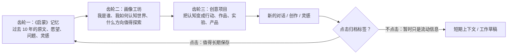
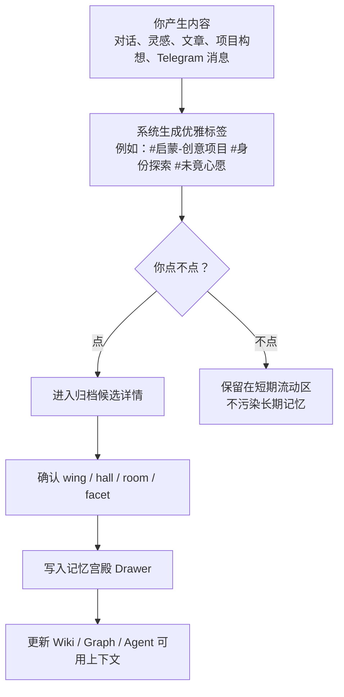
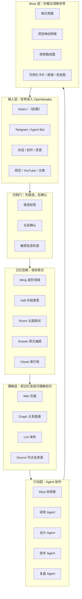
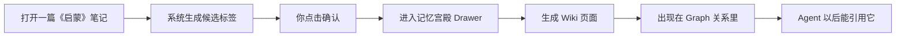

# 《启蒙》有机智能系统最终计划

> 面向超级技术小白的版本：我们先不把它想成“软件功能”，而把它想成一个会慢慢长大的个人智能生命系统。

## 0. 一句话总目标

把你过去 10 年对自己与世界的认知记录命名为 **《启蒙》**，用 **记忆宫殿** 承载原文，用 **画像工坊** 校准方向，用 **创意项目** 去行动探索，再用 **点击式归档标签** 把每次新的创作、对话、灵感沉淀回记忆宫殿。

最终它不是一个资料库，而是一个能和你共同成长的 **Openbasaka 有机智能系统**。

## 1. 先把词说成人话

| 名字 | 用小白语言理解 | 在系统里做什么 |
|---|---|---|
| 《启蒙》 | 你 10 年来的“精神原始档案” | 所有过往笔记、想法、困惑、项目愿望的根 |
| 记忆宫殿 | 一座给记忆分房间的大房子 | 原文保存、分类、查找、回溯来源 |
| Drawer 抽屉 | 一段原封不动的原文 | 任何内容先存原文，不先改写 |
| Closet 索引柜 | 抽屉外面的便签 | 快速告诉 AI：该去哪个抽屉找原文 |
| Wiki | 可阅读的知识书页 | 把记忆整理成“能理解的知识页面” |
| Graph 图谱 | 世界地图/关系网 | 看清人、项目、概念、愿望之间的关系 |
| 画像工坊 | 指南针 | 你的测试、偏好、价值观，用来决定方向 |
| 创意项目 | 行动臂 | 你探索世界的方法，不是普通项目管理 |
| 点击式归档标签 | 门卫 | 内容只有被你点击确认，才正式进入长期记忆 |
| Agent Bot | 分工伙伴 | 各自负责研究、设计、技术、复盘、陪伴等 |

## 2. 三架齿轮

这套系统必须靠三架齿轮一起转，任何一个齿轮脱离，系统都会变成普通工具。

### 齿轮一：《启蒙》记忆

它不是垃圾箱，也不是普通知识库。它是你过往探索世界的根。

原则：

- **原文优先**：先把原话、原笔记、原上下文保存起来。
- **不乱摘要**：AI 可以解释，但不能把原文替换掉。
- **可回溯**：任何结论都要能点回原始笔记。
- **可重分房间**：分类可以慢慢变好，但原文不能丢。

### 齿轮二：画像工坊

画像工坊不是测评玩具。它是系统理解“你如何探索世界”的方向盘。

它要回答：

- 什么问题会让你兴奋？
- 什么表达方式能让你快速理解？
- 哪些项目是真正符合你长期探索方向的？
- 哪些内容应该进入长期记忆，哪些只是噪音？

### 齿轮三：创意项目

你的项目不是普通 TODO。它们是你探索世界的方式。

所以项目系统要同时记录：

- 这个项目来自哪段《启蒙》记忆？
- 它满足画像工坊里的哪个方向？
- 它和哪些人、概念、愿望、旧项目有关？
- 它完成后又产生了哪些新的洞察，要不要回到《启蒙》？

## 3. 点击式归档门

这是整个系统最关键的交互。

一句话：**AI 可以推荐归档，但最终由你点击确认。**

这能避免两个危险：

- 系统把每句话都当宝贝，最后记忆变脏。
- 系统替你做决定，慢慢偏离你的真实意图。

## 4. 最终系统蓝图

## 5. 《启蒙》的默认分类规则

先用一套稳定但可进化的规则，不追求第一天完美。

### Wings：大翅膀，也就是高阶认知领域

| Wing | 含义 |
|---|---|
| `identity` | 我是谁、自我认知、人格、人生叙事 |
| `worldview` | 世界观、社会、文明、AI、未来、人类 |
| `method` | 方法论、学习方式、认知方式、表达方式 |
| `creation` | 创意、作品、产品、内容、审美 |
| `dialogue` | 重要对话、他人反馈、关系线索 |
| `profiling` | 画像工坊、测试结果、偏好与能力 |
| `wishes` | 未竟心愿、执念、长期想做的事 |
| `openbasaka` | Openbasaka / 记忆宫殿 / Agent 系统自身 |

### Halls：内容类型

| Hall | 适合放什么 |
|---|---|
| `identity` | 自我描述、人生阶段、价值观 |
| `consciousness` | 深层认知、哲学、世界理解 |
| `creative` | 创意项目、内容构想、产品设想 |
| `technical` | 技术方案、系统架构、工具实验 |
| `memory` | 回忆、旧记录、长期线索 |
| `emotions` | 情绪、关系、心境变化 |
| `family` | 家庭、亲密关系、个人背景 |

### Facets：叙事角色

Facet 不一定出现在界面第一层，它更像“这段记忆扮演什么角色”：

- `origin`：起源
- `question`：长期问题
- `wish`：愿望
- `project_seed`：项目种子
- `pain`：痛点
- `insight`：洞察
- `decision`：决定
- `evidence`：证据

## 6. baoyu-skills 在这里的作用

`baoyu-skills` 不是核心记忆系统，但它非常适合做 **表达层与理解层**。

| baoyu skill | 用在 Openbasaka 哪里 |
|---|---|
| `baoyu-diagram` | 把复杂系统画成架构图、流程图、关系图 |
| `baoyu-infographic` | 把阶段计划、项目复盘做成信息图 |
| `baoyu-image-cards` | 把知识点做成易懂卡片 |
| `baoyu-article-illustrator` | 给长文、Wiki、报告配图 |
| `baoyu-cover-image` | 给《启蒙》专题、项目档案生成封面 |
| `baoyu-url-to-markdown` | 把网页保存成 Markdown，再进入候选归档 |
| `baoyu-youtube-transcript` | 把 YouTube 内容转文字，作为学习素材 |
| `baoyu-translate` | 翻译重要资料，统一进入中文认知体系 |
| `baoyu-format-markdown` | 整理笔记格式，但不能改变原文含义 |

注意：微信发布类技能不是当前重点。你的 Openbasaka 入口应优先走 Telegram、桌面 App、Notes 和项目内 Agent Bot。

## 7. 分阶段执行计划

### Phase 0：先把地基修稳

目标：防止系统“聪明地犯错”。

必须完成：

- 停止随机 mock 成功结果污染项目和记忆。
- 给 Notes / 《启蒙》做敏感信息扫描，疑似 token、key、隐私内容先进隔离区。
- 建立 `operating_events` 的真实记录，让 Agent 做过什么都可追溯。
- 明确“候选归档”和“正式归档”的数据边界。

你能看到的结果：

- 一个安全体检页面。
- 一个“待归档候选箱”。
- 每个 Agent 行动都有清晰记录。

### Phase 1：建立《启蒙》入口

目标：让 6000 多篇笔记有一个统一身份。

必须完成：

- 把 Notes 作为《启蒙》原始资料源登记。
- 每篇先进入 Drawer 原文层。
- 生成初步 wing / hall / room / facet 建议，但不强行定死。
- 每条记忆都能点回原始文件。

你能看到的结果：

- 《启蒙》首页。
- 总笔记数、已归档数、未确认数、敏感隔离数。
- 按 wing/hall/room 浏览的记忆宫殿地图。

### Phase 2：做点击式归档标签

目标：让归档变成自然动作，而不是复杂后台操作。

必须完成：

- 所有新对话、创意、文章、项目卡片旁边出现优雅标签。
- 点击标签后出现归档确认层。
- 你可以改分类、加备注、决定是否入宫。
- 不点击就不进入长期记忆。

你能看到的结果：

- 每条重要内容旁边有自然标签。
- 点击后进入“归档候选详情”。
- 归档成功后显示它进入了哪个 wing / room。

### Phase 3：让 Wiki 和 Graph 活起来

目标：从“很多笔记”变成“能理解世界的地图”。

必须完成：

- Wiki 页面必须有来源。
- 修复大量孤儿页面，建立页面之间的连接。
- 生成人、项目、概念、愿望之间的关系图谱。
- 每个答案带证据和可点击来源。

你能看到的结果：

- 每个主题有知识页。
- 每个项目有来源链。
- 你可以问：“这个项目来自我哪段旧愿望？”

### Phase 4：Agent 团队真正协作

目标：Agent 不再各说各话，而是共享同一座记忆宫殿。

必须完成：

- Miya 只做协调者，不抢所有工作。
- 研究、设计、技术、复盘等 Agent 有明确职责。
- Agent 查询《启蒙》、Wiki、Graph 后再行动。
- 每次行动写入事件账本。

你能看到的结果：

- Telegram 里可以召唤不同 Agent。
- Agent 会引用你的旧记忆，而不是凭空发挥。
- 你可以追踪“这个建议是哪个 Agent 基于哪些来源提出的”。

### Phase 5：变成小白友好的探索驾驶舱

目标：你不需要懂技术，也能看懂系统在做什么。

必须完成：

- 每日简报：今天系统发现了什么、建议做什么。
- 项目神经网络：哪些项目彼此关联。
- 启蒙地图：哪些长期问题反复出现。
- 可视化输出：图谱、信息图、卡片、报告。

你能看到的结果：

- “今天我该关注什么？”
- “我最近的探索主线是什么？”
- “这些项目之间有什么隐藏关系？”
- “哪些旧愿望正在变成真实项目？”

## 8. 我们一起协作的方式

你只需要做三类决定：

1. **点不点归档**：这条内容值不值得进入长期记忆？
2. **分类对不对**：它应该属于哪个 wing / room？
3. **方向有没有感觉**：这个建议是否符合你探索世界的方式？

技术部分由我负责：

- 把复杂系统拆成能理解的图。
- 把代码改动变成你能看到的界面结果。
- 每一步验证是否真的跑起来。
- 避免让系统污染你的长期记忆。

## 9. 最小可行版本

不要第一步就追求宇宙飞船。第一版只做一条闭环：

这条闭环跑通后，整个系统才真正开始“长记性”。

## 10. 下一步

下一步应该从 Phase 0 + Phase 1 开始：

1. 固化《启蒙》的数据契约。
2. 做敏感信息隔离。
3. 做归档候选表。
4. 做第一个可点击归档标签。
5. 选 20 篇笔记做试点，不直接吞 6000 多篇。
6. 试点成功后，再批量迁移。

这不是保守，而是保护你的 10 年记忆不被粗暴处理。

## 参考来源

- baoyu-skills: https://github.com/JimLiu/baoyu-skills
- MemPalace: https://github.com/MemPalace/mempalace
- 本地 Hermes Agent: `/Users/apple/Desktop/【项目的游戏】/hermes-agent`
- 本地《启蒙》资料源: `/Users/apple/Desktop/【项目的游戏】/Notes`
- 既有融合计划: `/Users/apple/Desktop/【项目的游戏】/docs/有机智能系统融合计划-Graphify-Hermes.md`
