# 项目全状态审计报告 — Game of Projects (openbasaka)

> 审计日期：2026-04-12
> 审计范围：全部 ~80 个 TypeScript/TSX 源文件、~25 个 CSS 文件、17 张 SQLite 表

---

## 一、项目基础信息

| 项目 | 值 |
|------|-----|
| 名称 | game-of-projects |
| 版本 | 0.1.0 |
| 定位 | 个人元宇宙外脑操作系统 & 现实世界战略推演沙盘 |
| 技术栈 | Electron 41 + React 19 + TypeScript 6 + Vite 8 + better-sqlite3 |
| 运行时依赖 | 仅 4 个 (react, react-dom, better-sqlite3, cron-parser) |
| UI 库 | 无，全部手写 CSS（Hermes Dark 主题） |
| 路由 | 手写 hash-based 路由 |
| 测试 | 0 个测试文件 |

---

## 二、构建状态

### 修复前：构建失败

| 问题 | 文件 | 修复 |
|------|------|------|
| CSS 多余 `}` | `TeamsTab.css:382` | 已删除 |
| cron-parser import 不匹配 | `cron-engine.ts:7` | 已修复为 `CronExpressionParser` |
| vite-env.d.ts 缺少类型 | `vite-env.d.ts` | 已补全 9 个方法声明 |
| SkillOutput.duration 类型 | `executor.ts` | 已改为 optional |

### 修复后状态

- `npx tsc --noEmit` → **0 错误** ✅
- `npm run build` → **构建成功** ✅

### 仍存在的 IPC 缺失

preload 暴露了 `sendToAI` 和 `streamAI`，但主进程未注册 `send-ai` 和 `stream-ai` 处理器。

---

## 三、应用窗口架构

应用启动后创建 **2 个 Electron 窗口**：

| 窗口 | 尺寸 | 样式 | 路由 | 功能 |
|------|------|------|------|------|
| Ghost（助手） | 520×780，最小 400×500 | 无边框、始终置顶、透明标题栏、暗色 #041c1c | `#/` | Openbasaka 数字副官聊天 |
| Sandbox（沙盘） | 1400×900，最小 1000×700 | 无边框、暗色背景 | `#/sandbox` | 战略沙盘 7 Tab |

系统托盘：绿/青点图标，右键菜单含打开沙盘/显示助手/导出/导入/设置/退出。

---

## 四、路由与页面（附截图）

| Hash 路由 | 组件 | 功能 | 实现度 |
|-----------|------|------|--------|
| 首次启动 | Onboarding | 3 步引导向导 | ✅ 完整 |
| `#/` | Openbasaka | AI 聊天 + 专家路由 + Soul 编辑 | ✅ 完整 |
| `#/ghost` | GhostWidget | PRD 评估引擎（拖拽 PRD → 模拟评估） | ✅ 完整 |
| `#/sandbox` | SandboxMap | 战略沙盘（7 tab） | ✅ 完整（1 tab 是 stub） |
| `#/settings` | Settings | 设置面板（4 sub-tab） | ✅ 完整 |

---

## 五、各页面详细说明

### 5.1 Onboarding（首次启动引导）

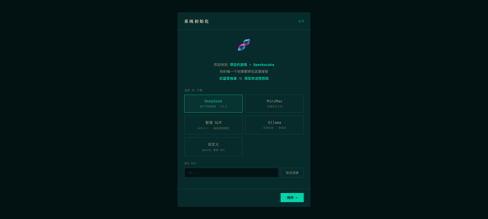

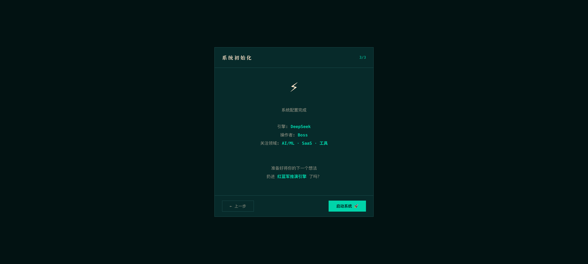

3 步向导：
1. **AI 引擎选择** — 选择 AI 供应商（DeepSeek / MiniMax / GLM / Ollama / Custom）
2. **API Key 输入** — 输入对应的 API Key
3. **确认启动** — 检查配置并进入主界面

---

### 5.2 `#/` — Openbasaka 数字副官

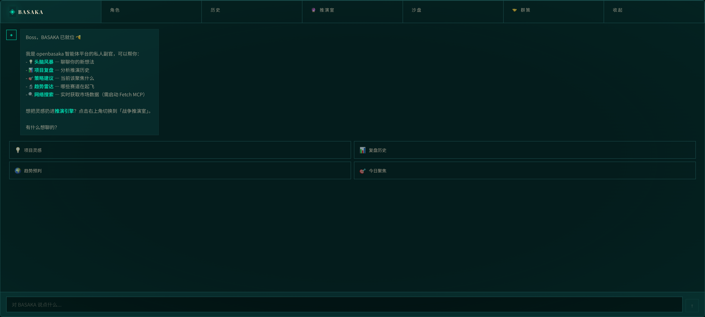

#### 顶部导航
- Logo（显示当前活跃专家 emoji）
- "Roles" 切换按钮 → 展开专家选择栏
- "History" 切换按钮 → 展开历史会话列表
- 导航链接：War Room / Sandbox / Teams / Minimize

#### 专家路由
6 个内置专家角色，两种模式：
- **手动模式**：锁定选中的专家
- **智能匹配**：根据消息内容自动路由（关键词正则匹配，零延迟）

| 专家 ID | 图标 | 温度 | 专长 |
|---------|------|------|------|
| general (BASAKA) | ◈ | 0.6 | 全能助手 |
| strategy | ◈ | 0.6 | 商业策略 |
| technical | ◈ | 0.5 | 技术架构 |
| market | ◈ | 0.7 | 市场营销 |
| creative | ◈ | 0.8 | 创意设计 |
| critic | ◈ | 0.4 | 批判审查 |

#### Soul 面板
点击已选中的专家 → 展开侧面板，可编辑：
- 身份描述
- 语气风格
- 行为准则
- 避免行为
- 自定义覆盖

编辑后存入 `agent_souls` 表，含注入扫描防护。

#### 聊天区域
- 用户消息 + AI 回复气泡
- 流式输出（SSE，带闪烁光标动画）
- 思考指示器（3 点跳动）
- 粗体 Markdown 解析
- 项目创意检测 → 弹出"发送到评估引擎？"按钮

#### 快捷动作
4 个预设提示按钮：头脑风暴 / 复盘 / 趋势 / 聚焦

---

### 5.3 `#/ghost` — War Room（PRD 评估引擎）

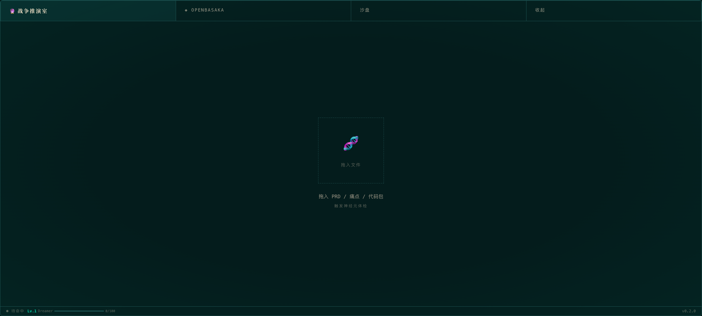

#### 核心数据流（全部真实 LLM 调用）
```
PRD 文本 → parsePRD(LLM) → runWarRoom(3角色模拟) → classifyProject(9维分类+SWOT)
→ dbSaveTaxonomy → recordEvaluationXP → extractFromEvaluation(记忆写入)
```

#### 4 个状态

1. **idle** — 显示拖拽区域 + 历史评估列表（最多 5 条）
2. **ingesting** — 终端风格日志输出 + 进度条 + 脉冲动画
3. **analyzing** — 三角色串行模拟（竞争分析师 → 挑剔用户 → 冷酷投资人 → 生存评估师）
4. **reporting** — 显示结果：
   - 六边形雷达图（时代适配 / Boss匹配 / 变现力 / 技术突破 / 资源成本 / 风险指数）
   - 生存率 + 等级
   - 战略建议
   - 三个决策按钮：**追求 / 转向 / 放弃**

#### 降级策略
当 LLM 不可用时（无 API Key），自动降级为本地模拟数据，界面仍正常渲染。

---

### 5.4 `#/sandbox` — 战略沙盘（7 个 Tab）

#### Tab 1: 🧬 神经元 (NeuronsTab) ✅ 完整

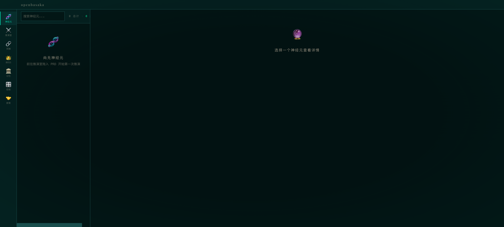

**左右两栏布局：**

左栏：
- 搜索框 + 统计栏（总数/高存活/低存活）
- 项目卡片列表（状态徽章、标题、分类标签、存活率%）

右栏（选中项目后）：
- 六边形雷达图（6 轴）
- 可折叠推演日志（终端风格）
- 可折叠分类信息（行业、商业模式、市场规模等）
- SWOT 分析网格（4 象限色彩编码）
- 时代潜力评分（时代相关性、突破潜力、差异化）
- 战略建议文本

空状态："暂无神经元 — 去 War Room 投入一份 PRD"

---

#### Tab 2: ⚔️ 推演室 (WarRoomTab) ❌ 纯 Stub


仅渲染 EmptyState 组件："推演室全景 — 推演引擎扩展后将启用"。**零功能。**

---

#### Tab 3: 🔗 突触 (SynapsesTab) ✅ 完整

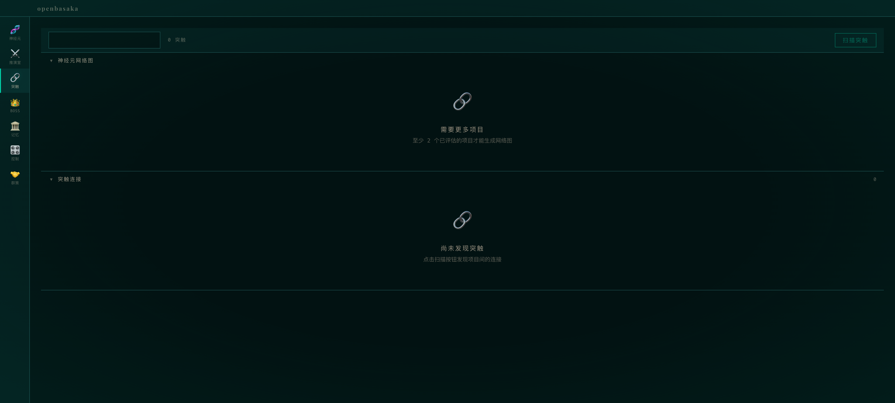

- 搜索/统计栏 + 按 synapse 类型分类的数量
- "扫描突触"按钮 → LLM 计算跨项目连接
- **NetworkGraph**：Canvas 力导向图（Boss 中心节点 + 项目节点 + 突触连线），可拖拽、可点击
- 突触连接列表：卡片显示类型（颜色编码）、强度%、项目对、原因
- 选中突触详情：行动项 + "探索混合创新"按钮
- 混合创新区：标题、一句话描述、可行性/兴奋度/努力度评分

需要 2+ 个已分类项目才能工作。

---

#### Tab 4: 👑 Boss (BossTab) ✅ 完整

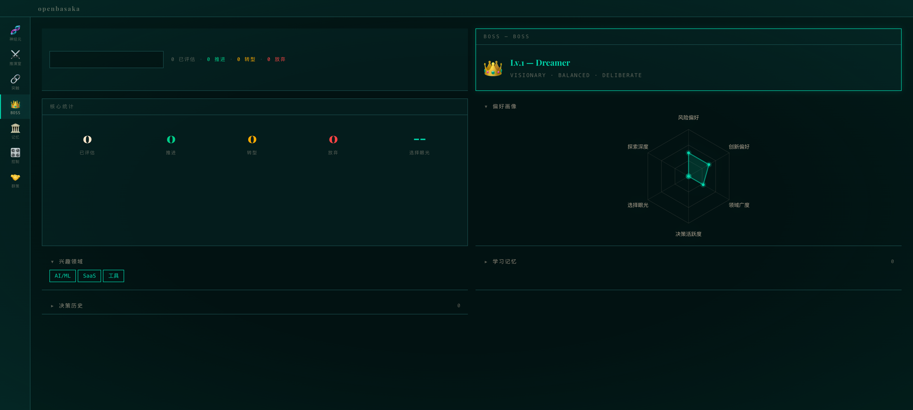

- 统计栏（已评估/已追求/已转向/已放弃）
- Boss 卡片：名称、等级 + 称号（`calculateBossLevel` 自动计算）
- 核心统计网格（5 指标）
- 六边形雷达偏好画像（6 轴：风险容忍、创新偏好、领域广度、决策活跃、选择眼光、探索深度）
- 兴趣标签 + 厌恶标签
- 学习记忆（可折叠，最多 15 条，按分类颜色编码）
- 决策历史（可折叠，终端风格，按类型颜色编码）
- 目标与愿景（长期愿景 + 短期目标）

---

#### Tab 5: 🏛️ 记忆 (MemoryTab) ✅ 完整

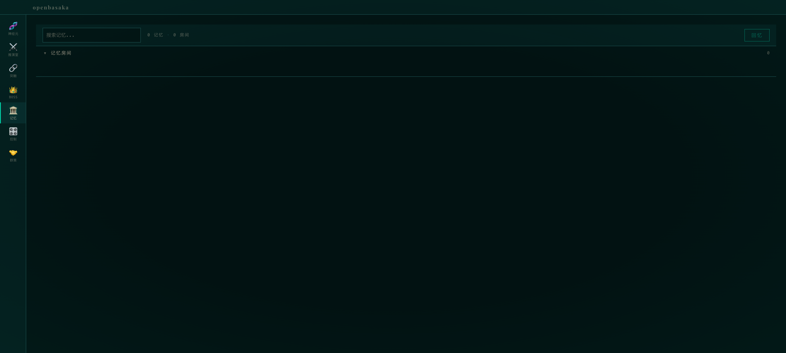

- 搜索栏 + 统计（总记忆数、房间数）+ "回忆"按钮
- 搜索结果（FTS5 全文搜索 + 3 因子评分：重要性 + 时效性 + 访问频次）
- 记忆房间网格（5 个预设房间）：
  - ⚔️ War Room Archives
  - 👑 Boss's Patterns
  - ⚰️ Project Graveyard
  - 💡 Innovation Lab
  - 📅 Timeline
- 房间详情：记忆条目列表 + 重要性评分 + 删除按钮

---

#### Tab 6: 🎛️ 控制 (ControlPanelTab) ✅ 完整

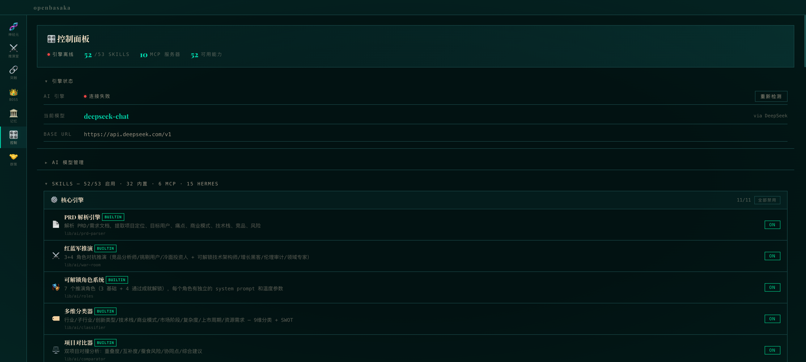

- **概览横幅**：引擎状态徽章、已启用/总技能数、MCP 服务器数、总能力数
- **引擎状态**：在线/离线/检查中/错误、当前模型、Base URL、重检按钮
- **AI 模型管理**（可折叠）：
  - 供应商网格：DeepSeek / MiniMax / GLM / Ollama / Custom
  - API Key 输入、Base URL、模型选择（下拉/文本）、保存按钮
- **技能管理**（可折叠）：
  - 按类别分组（9 类），每技能显示图标/名称/来源/描述/模块/MCP 依赖
  - 每技能 ON/OFF 开关 + 按类别批量开关
- **MCP 服务器管理**（可折叠）：
  - 10 个预配置服务器卡片：状态徽章、描述、类别、工具数、命令、环境变量
  - 启动/停止/移除按钮 + "添加自定义 MCP"表单
- **开发者工具**（可折叠）：DevTools 按钮、系统信息、版本标签

> **注意：** MCP "启动/停止"仅切换 UI 中的状态徽章并保存到 localStorage，**不会实际启动/停止 MCP 服务器进程**。

---

#### Tab 7: 🤝 群策 (TeamsTab) ✅ 完整（最复杂的 tab）

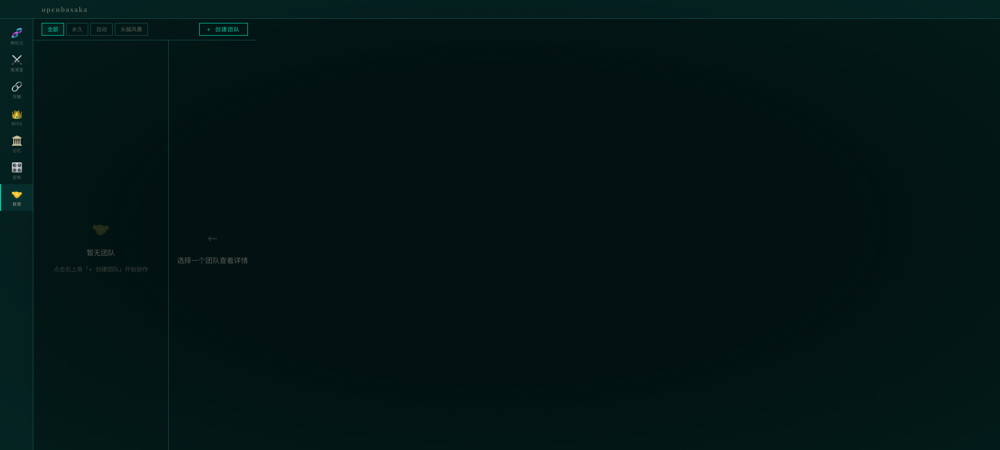

**结构：**
- 顶部：筛选按钮（全部/永久/自动/头脑风暴）+ "创建团队"按钮
- 左栏：团队列表 + 类型标签 + 成员数
- 右栏（选中团队后）：
  - 团队信息：名称、类型、描述、通信模式、编辑/解散按钮
  - 成员列表：图标 + 名称 + 角色
  - **智能 PRD 生成区**：
    - 说明文字 + "生成 PRD"按钮
    - 点击 → 弹出 5 个问题 Modal → 4 轮生成 → 16 章节结果
    - 每章节可折叠展开 + "复制"按钮
    - "下载 Markdown"按钮
  - **群聊区**：
    - WorkflowDiagram（如有团队任务定义）
    - 话题输入 + 开始按钮
    - 彩色 Agent 消息气泡（6 色按角色分配）
    - 综合结论 + "下载记录"按钮

**创建/编辑团队 Modal（双 Tab）：**
- Tab 1 "创建团队"：名称、描述、类型（永久/头脑风暴）、通信模式（顺序/轮次/广播）、成员选择器
- Tab 2 "自定义 Agent"：名称、12 个 Emoji 图标选择、角色描述（System Prompt）、8 种主题色、温度滑块

---

### 5.5 `#/settings` — 设置

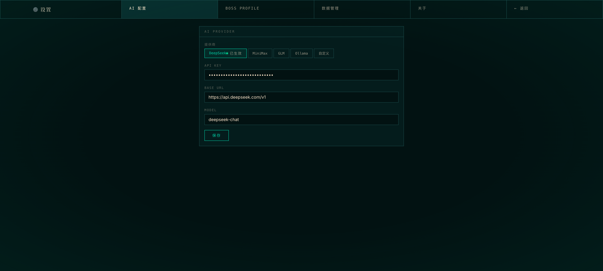

4 个 sub-tab 的设置面板。

---

## 六、后端模块状态总览

### 数据库：17 张表 + 2 个 FTS5 虚拟表

```
projects, boss_profile, settings, conversations, project_versions,
boss_decisions, boss_memory, project_taxonomy, synapses,
memory_rooms, memory_items, memory_fts (FTS5),
custom_agents, agent_souls, agent_memories,
workflows, workflow_runs, skill_evolution, scheduled_tasks,
conversation_fts (FTS5), teams, team_sessions
```

### 模块评估

| 模块 | 状态 | 说明 |
|------|------|------|
| AI Provider | ✅ 完整 | 5 供应商，双协议（OpenAI/Anthropic），流式+非流式 |
| AI Prompts | ✅ 完整 | 10 个集中管理的 System Prompt 模板 |
| AI Classifier | ✅ 完整 | LLM 9 维分类 + 正则降级 |
| War Room Engine | ✅ 完整 | 3 角色串行模拟 + 生存评估 |
| Memory Palace | ✅ 完整 | 5 房间，完整 CRUD |
| Self-Nudge | ✅ 完整 | 对话后知识提取 → 记忆宫殿 + Agent Memory + 知识图谱 |
| Knowledge Graph | ✅ 完整 | 三元组存储、BFS 遍历、社区发现、LLM 自动提取 |
| Recall | ✅ 完整 | FTS5 + 3 因子评分（重要性+时效+访问频次） |
| Extractor | ✅ 完整 | 3 个提取器 + Boss 同步 |
| Agent Memory (L0-L3) | ✅ 完整 | 4 层记忆栈 + 注入扫描 |
| Skills Registry | ✅ 完整 | 44 技能，9 类别 |
| Skills Evolution | ✅ 完整 | 自进化系统：使用 ≥5 且 %10===0 且成功率<80% → LLM 优化 Prompt |
| Skills Executor | ✅ 完整 | 3 路分派（MCP/LLM/本地） |
| Agent Registry | ✅ 完整 | 6 内置 + 自定义 CRUD |
| Agent Soul | ✅ 完整 | 6 个 Soul + 覆盖系统 + 注入防护 |
| Chat Router | ✅ 完整 | 关键词正则路由，零延迟 |
| Chat Session | ✅ 完整 | 保存即触发学习（self-nudge + skill evolution + 知识图谱） |
| Chat Context | ✅ 完整 | 10 层 Prompt 组装 + Token 预算管理 |
| Chat Tool Loop | ✅ 完整 | ReAct 模式，5 轮上限 |
| Teams | ✅ 完整 | 3 类型，3 执行引擎（顺序/拓扑/轮次） |
| PRD Generator | ✅ 完整 | 4 轮生成，6 专家审阅，16 章节 |
| Boss Profile | ✅ 完整 | 20+ 字段，Honcho 辩证法用户建模 |
| Synapse Scorer | ✅ 完整 | 6 类型，分类重叠 + LLM 增强 |
| Synapse Innovator | ✅ 完整 | 跨领域混合创新 |
| Synapse Swarm | ✅ 完整 | 3 模式神经元激活模拟 |
| Tools (33个) | ✅ 完整 | 29 个有真实执行器，4 个 HA 工具默认禁用 |
| MCP Client | ⚠️ 部分 | 依赖 Electron 主进程实际实现 |
| MCP Registry | ✅ 完整 | 10 个预配置服务器 |
| Era Variables | ✅ 完整 | LLM 生成，24h 缓存 |
| Game Progression | ✅ 完整 | 9 种 XP 动作，12 成就，6 称号 |
| Cron Engine | ⚠️ 部分 | 60s 轮询，但任务执行全部 stub（仅 console.log） |

---

## 七、IPC 通道清单（16+2 个）

| 通道 | 用途 | 状态 |
|------|------|------|
| `open-sandbox` | 打开/聚焦沙盘窗口 | ✅ |
| `minimize-to-tray` | 隐藏助手到托盘 | ✅ |
| `get-system-info` | 返回平台/架构 | ✅ |
| `get-app-data` | 返回 userData 路径 | ✅ |
| `db-query` | SQLite SELECT | ✅ |
| `db-run` | SQLite INSERT/UPDATE/DELETE | ✅ |
| `read-file` | 读取磁盘文件 | ✅ |
| `write-file` | 写入磁盘文件 | ✅ |
| `execute-command` | 执行 shell 命令 | ✅ |
| `export-database` | 导出数据库为 JSON | ✅ |
| `import-database` | 从 JSON 导入数据库 | ✅ |
| `broadcast-to-windows` | 广播消息到所有窗口 | ✅ |
| `mcp-spawn` | 启动 MCP 服务器进程 | ✅ |
| `mcp-call-tool` | 调用 MCP 工具 | ✅ |
| `mcp-list-tools` | 列出 MCP 工具 | ✅ |
| `mcp-stop` | 停止 MCP 服务器 | ✅ |
| `send-ai` | 发送到 AI | ❌ preload 暴露但主进程未注册 |
| `stream-ai` | AI 流式响应 | ❌ preload 暴露但主进程未注册 |

---

## 八、工具系统（33 个工具）

### Tier 1（核心 — 4 个）

| ID | 名称 | 执行方式 |
|----|------|---------|
| `web_search` | 网络搜索 | MCP brave-search 桥接 |
| `web_extract` | 网页提取 | MCP fetch 桥接 |
| `clarify` | 澄清提问 | 本地（返回问题对象） |
| `vision_analyze` | 图像分析 | LLM 多模态 |

### Tier 2（扩展 — 14 个）

| ID | 名称 | 执行方式 |
|----|------|---------|
| `terminal` | 终端执行 | Electron IPC execute-command |
| `file_read` | 文件读取 | Electron IPC read-file |
| `file_write` | 文件写入 | Electron IPC write-file |
| `code_execute` | 代码执行 | JS 沙箱 `new Function()` |
| `tts` | 语音合成 | Web Speech API |
| `process` | 进程管理 | IPC execute-command |
| `patch` | 文件补丁 | 3 步 IPC（read → replace → write） |
| `search_files` | 文件搜索 | IPC execute-command + ripgrep |
| `image_generate` | 图像生成 | LLM 生成描述 prompt |
| `todo` | 任务清单 | SQLite CRUD |
| `memory` | 持久记忆 | addMemoryEntry |
| `session_search` | 会话搜索 | SQL LIKE |
| `execute_code` | 代码执行 | JS 沙箱或 IPC python3 |
| `delegate_task` | 子代理委派 | LLM 子调用 |

### Tier 3（集成 — 15 个）

| ID | 名称 | 执行方式 |
|----|------|---------|
| `memory_search` | 记忆搜索 | renderL3DeepSearch + FTS5 |
| `knowledge_add` | 知识添加 | addTriple 知识图谱 |
| `send_message` | 发送消息 | SQLite 写入 chat_messages |
| `skills_list` | 技能列表 | loadSkills 本地调用 |
| `skill_view` | 技能查看 | SQLite 查询 skill_evolution |
| `skill_manage` | 技能管理 | createSkill + saveSkillsState |
| `browser_navigate` | 浏览器导航 | MCP playwright 桥接 |
| `browser_snapshot` | 浏览器快照 | MCP playwright 桥接 |
| `browser_click` | 浏览器点击 | MCP playwright 桥接 |
| `browser_type` | 浏览器输入 | MCP playwright 桥接 |
| `browser_scroll` | 浏览器滚动 | MCP playwright 桥接 |
| `browser_back` | 浏览器后退 | MCP playwright 桥接 |
| `browser_press` | 浏览器按键 | MCP playwright 桥接 |
| `browser_get_images` | 浏览器图片 | MCP playwright 桥接 |
| `browser_vision` | 浏览器视觉 | MCP playwright 桥接 |
| `browser_console` | 浏览器控制台 | MCP playwright 桥接 |
| `ha_list_entities` | HA 实体列表 | HTTP fetch（默认禁用） |
| `ha_get_state` | HA 状态查询 | HTTP fetch（默认禁用） |
| `ha_list_services` | HA 服务列表 | HTTP fetch（默认禁用） |
| `ha_call_service` | HA 服务调用 | HTTP fetch（默认禁用） |
| `cronjob` | 定时任务 | SQLite CRUD |

---

## 九、10 层 Prompt 组装（Chat Context）

每次聊天，系统按优先级组装 10 层 Prompt（2500 token 预算）：

| 层 | 内容 | 来源 |
|----|------|------|
| 1 | Soul 身份核心 | L0 Identity（~100 tokens） |
| 2 | 工具指导 | legacy + Hermes 双系统 |
| 3 | 记忆快照 | L0 + L1 + L2（Agent Memory） |
| 4 | Boss 画像 | boss_profile 表 |
| 5 | 近期决策 | 最近 5 条 boss_decisions |
| 6 | 活跃项目 | projects 表 |
| 7 | 近期洞察 | 7 天窗口内 boss_memory |
| 8 | 时代变量 + 突触 + 知识图谱 | era_variables + synapses + knowledge_triples |
| 9 | 技能索引 | skills registry |
| 10 | 时间戳 | 当前时间 |

溢出时按优先级从低到高裁剪。

---

## 十、MemPalace 4 层记忆栈

| 层 | 函数 | Token 预算 | 激活时机 |
|----|------|-----------|---------|
| L0 Identity | `renderL0Identity()` | ~100 | 每次对话 Layer 1 |
| L1 Essential | `renderL1Essential()` | ~500-800 | 每次对话 Layer 3 |
| L2 On-Demand | `renderL2OnDemand()` | ~200-500 | 关键词触发 Layer 3.5 |
| L3 Deep Search | `renderL3DeepSearch()` | 无限 | memory_search 工具 |

写入路径：`saveSession()` → `triggerPostSessionLearning()` → `selfNudgeFromConversation()` + `createSkillFromExperience()` + `extractTriplesFromText()`

---

## 十一、Hermes 技能自进化

```
技能执行 → recordSkillUsage() → shouldEvolve()?
  → 使用 ≥5 次且 usage%10===0 且 成功率<80%?
    → evolveSkillPrompt() — LLM 分析失败模式并重写 System Prompt
      → 存入 skill_evolution.improved_prompt
        → 下次执行时自动使用进化后的 Prompt
```

---

## 十二、Stub 与已知问题

### Stub 组件（2 个）
1. **WarRoomTab** — 纯 EmptyState 占位，无任何功能
2. **QuickChat** (`src/views/GhostWidget/QuickChat.tsx`) — 返回 null，注释 "Phase 2"

### 模拟功能（非真实）
1. **MCP 服务器启停** — ControlPanelTab 中点击"启动/停止"仅切换 UI 状态，不实际启动/停止进程
2. **Cron Engine 任务执行** — 60s 轮询正常，但所有 4 种任务类型（research/report/memory-scan/custom）的执行逻辑全部是 `console.log`，无实际效果

### IPC 缺失
- `send-ai` / `stream-ai`：preload 暴露但主进程未注册，调用将永久挂起

### 安全注意事项
1. `db-query`/`db-run` 允许渲染进程执行任意 SQL
2. `execute-command` 允许渲染进程执行任意 shell 命令
3. `read-file`/`write-file` 无路径限制
4. 以上均为 Electron 本地桌面应用，非网络服务，风险相对可控

---

## 十三、设计系统 — Hermes Dark

### 主题变量

```
背景层级: #021212 → #041c1c → #072a2a → #0a3535
文字主色: rgb(255,230,203)（暖奶油色）
强调色:   #00d4aa (cyan/青绿) — 主强调
         #ffd700 (gold/金) — 次强调
         #8b5cf6 (purple/紫) — PRD 专用
         #ef4444 (red) — 警告/危险
字体:     Playfair Display (display) / Inter (body) / Noto Sans SC (中文) / SF Mono (mono)
圆角:     极简 Brutalist（2/4/8px）
边框:     1px 青色系 (#1a4a4a, #103333)
动画:     打字机/晕影脉冲/呼吸/淡入/扫描线/金色爆发/吸收/数字弹出
```

### 11 个共享组件

| 组件 | 功能 |
|------|------|
| VignetteGlow | CRT 边缘光晕覆盖层 |
| GridCard | 1px 边框 Brutalist 卡片 |
| TerminalBlock | macOS 风格终端（红黄绿点 + 等宽内容） |
| HexRadar | Canvas 六边形雷达图（6 轴） |
| StatusBadge | 彩色圆点 + 标签徽章 |
| EmptyState | 图标 + 标题 + 描述 + 可选操作按钮 |
| WarningBanner | 警告横幅（图标+消息+操作+关闭） |
| SearchStatsBar | 搜索输入 + 统计标签 + 操作插槽 |
| CollapsibleSection | 展开/折叠（箭头+标题+计数+可选徽章） |
| SidebarNav | 垂直图标+标签导航（活跃状态+徽章） |
| AgentAvatar | Agent 头像（emoji 或程序化 SVG 几何艺术） |

---

## 十四、下一步建议

1. **注册缺失 IPC** — `send-ai` / `stream-ai` 处理器注册到主进程
2. **实现 WarRoomTab** — 目前为纯 stub，可复用 WarRoom Engine 逻辑
3. **Cron Engine 任务执行** — 4 种任务类型的实际执行逻辑
4. **MCP 进程管理** — ControlPanelTab 的启停需连接到 mcp-manager
5. **测试框架** — 0 个测试文件，建议至少添加关键模块的单元测试

---

*报告结束*
